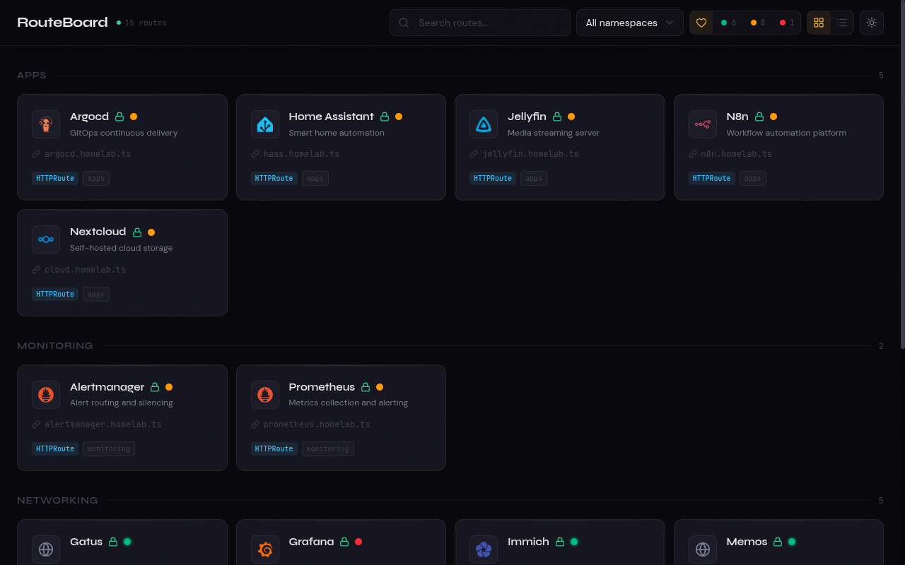
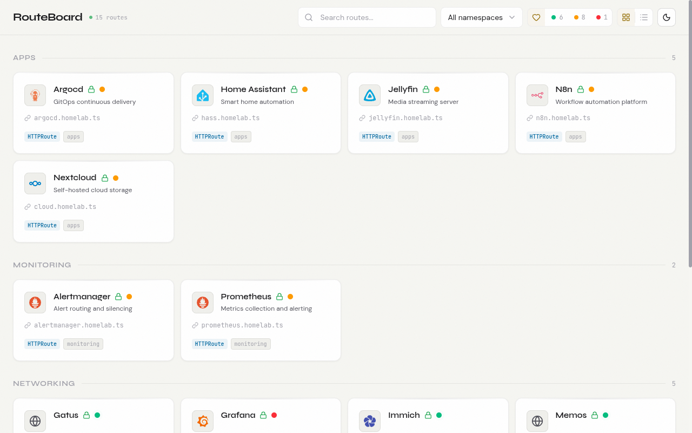
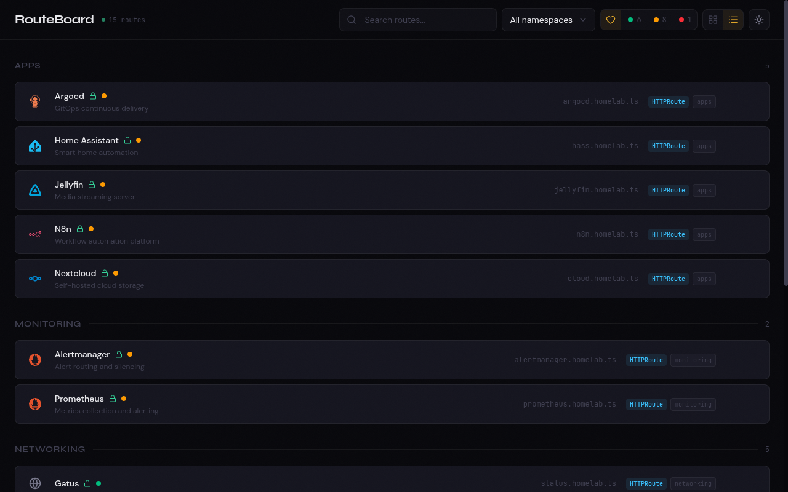
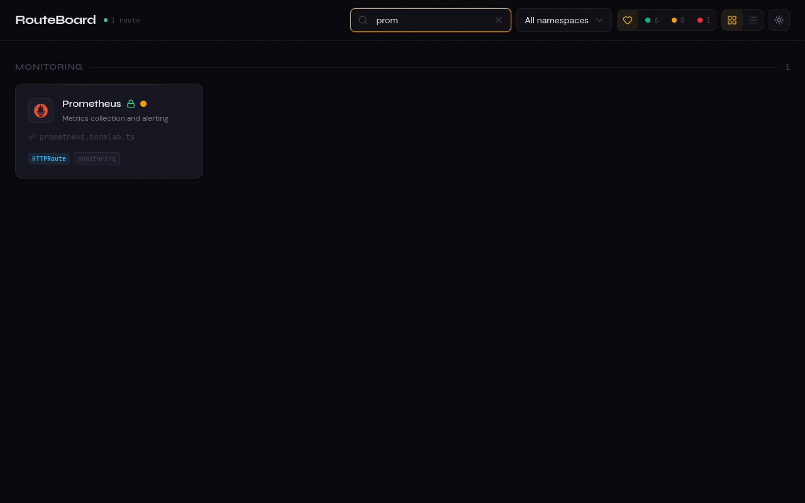

# RouteBoard

**A Kubernetes-native Service Entry Portal that auto-discovers your Ingress and HTTPRoute resources and generates a beautiful, real-time dashboard.**



## Why?

I run a homelab Kubernetes cluster with dozens of services — Grafana, Vaultwarden, Immich, Memos, Nextcloud, and more. Every time I added a new service, I had to manually update a static landing page. I wanted something that:

- **Just works** — deploy it and it discovers everything automatically
- **Stays current** — when I add or remove a service, the dashboard updates in real-time
- **Shows health** — at a glance, I can see which services are up, degraded, or down
- **Looks good** — not another ugly admin panel, but something I'd actually want as my browser homepage
- **Supports Gateway API** — most alternatives only support Ingress, but I've moved to HTTPRoute

Existing tools didn't fit: [Backstage](https://backstage.io/) is too heavy, [Homer](https://github.com/bastienwirtz/homer) is static, [Hajimari](https://github.com/toboshii/hajimari) and [Forecastle](https://github.com/stakater/Forecastle) only support Ingress and have no health monitoring. RouteBoard fills the gap.

## Features

- **Auto-discovery** — watches Kubernetes Ingress and HTTPRoute resources in real-time via informers
- **Zero config** — deploy with Helm and it works immediately, no configuration required
- **Health monitoring** — pings each service periodically, shows green/yellow/red status badges
- **Brand icons** — automatically fetches real SVG brand icons from [Simple Icons](https://simpleicons.org/) for 65+ services
- **Annotation-driven** — customize titles, descriptions, groups, and icons via Kubernetes annotations
- **Real-time updates** — Server-Sent Events push changes to the browser instantly
- **Gateway API first-class** — supports both `networking.k8s.io/v1 Ingress` and `gateway.networking.k8s.io/v1 HTTPRoute`
- **Dark & light mode** — with localStorage persistence
- **Grid & list views** — switch between card grid and compact list
- **Search & filter** — by name, namespace, or health status
- **Click-to-copy URLs** — one click to copy any service URL to clipboard
- **Lightweight** — single Go binary (~69MB with embedded frontend), <30MB memory usage

## Screenshots

| Dark Mode | Light Mode |
|---|---|
|  |  |

| List View | Search |
|---|---|
|  |  |

## Quick Start

### Helm (recommended)

```bash
helm install routeboard oci://ghcr.io/dhia-gharsallaoui/helm/routeboard \
  -n routeboard --create-namespace
```

Then port-forward and open in your browser:

```bash
kubectl port-forward -n routeboard svc/routeboard 8080:80
open http://localhost:8080
```

### From source

```bash
helm install routeboard deploy/helm/routeboard \
  -n routeboard --create-namespace
```

### Local Development

```bash
# Backend (requires KUBECONFIG)
make run

# Frontend (separate terminal)
make web-dev
```

### Docker

```bash
docker run -v ~/.kube/config:/home/nonroot/.kube/config:ro \
  ghcr.io/dhia-gharsallaoui/routeboard:latest
```

## Configuration

All configuration is via environment variables. Everything has sensible defaults — zero config is valid.

| Variable | Default | Description |
|---|---|---|
| `ROUTEBOARD_PORT` | `8080` | HTTP server port |
| `ROUTEBOARD_TITLE` | `RouteBoard` | Dashboard title |
| `ROUTEBOARD_WATCH_INGRESS` | `true` | Watch Ingress resources |
| `ROUTEBOARD_WATCH_HTTPROUTE` | `true` | Watch HTTPRoute resources |
| `ROUTEBOARD_NAMESPACE_DENYLIST` | `kube-system,kube-public,kube-node-lease` | Namespaces to exclude |
| `ROUTEBOARD_NAMESPACE_ALLOWLIST` | *(all)* | Only watch these namespaces |
| `ROUTEBOARD_HEALTH_ENABLED` | `true` | Enable health checks |
| `ROUTEBOARD_HEALTH_INTERVAL` | `30s` | Health check interval |
| `ROUTEBOARD_HEALTH_TIMEOUT` | `5s` | Health check timeout |
| `ROUTEBOARD_LOG_LEVEL` | `info` | Log level (debug/info/warn/error) |
| `ROUTEBOARD_LOG_FORMAT` | `text` | Log format (text/json) |

## Annotations

Annotate your Ingress or HTTPRoute resources to customize how they appear on the dashboard. All annotations are optional — routes are discovered automatically by default.

```yaml
metadata:
  annotations:
    routeboard.io/title: "Grafana"              # Display name (default: titleized resource name)
    routeboard.io/description: "Monitoring"      # Short description
    routeboard.io/icon: "📊"                     # Override auto-detected icon
    routeboard.io/group: "Monitoring"            # Custom group (default: namespace)
    routeboard.io/order: "10"                    # Sort order within group
    routeboard.io/hidden: "true"                 # Hide from dashboard
    routeboard.io/url: "https://custom.url"      # Override computed URL
    routeboard.io/health: "false"                # Exclude from health checks (route stays listed)
```

## Architecture

```
Kubernetes API ──> Informers ──> Route Store ──> SSE Broker ──> React SPA
                   (Ingress)     (in-memory)     (push)        (real-time)
                   (HTTPRoute)       │
                                     └──> Health Checker (periodic HEAD requests)
```

- **Backend**: Go with `client-go` informers — native Kubernetes integration, no polling
- **Frontend**: React 19 + Vite + Tailwind CSS v4 — embedded in the Go binary
- **Real-time**: Server-Sent Events — no WebSocket complexity, one-directional push
- **No database**: In-memory store populated by informer cache, stateless

## RBAC

RouteBoard needs read-only access to Ingress and HTTPRoute resources. The Helm chart creates a ClusterRole with minimal permissions:

```yaml
rules:
  - apiGroups: ["networking.k8s.io"]
    resources: ["ingresses"]
    verbs: ["get", "list", "watch"]
  - apiGroups: ["gateway.networking.k8s.io"]
    resources: ["httproutes"]
    verbs: ["get", "list", "watch"]
```

## Tech Stack

| Component | Technology |
|---|---|
| Backend | Go 1.26, client-go, gateway-api |
| Frontend | React 19, Vite, Tailwind CSS v4 |
| Icons | [Lucide](https://lucide.dev/) + [Simple Icons](https://simpleicons.org/) CDN |
| Package manager | [Bun](https://bun.sh/) |
| Linter | [Biome](https://biomejs.dev/) (frontend), golangci-lint (backend) |
| Deployment | Helm, Docker (distroless) |

## API

RouteBoard exposes a JSON API alongside the dashboard:

| Endpoint | Description |
|---|---|
| `GET /api/routes` | All discovered routes (supports `?namespace=X&q=search`) |
| `GET /api/config` | Dashboard config (title, namespaces) |
| `GET /api/events` | SSE stream (route changes + health updates) |
| `GET /health` | Liveness probe |

## License

MIT
